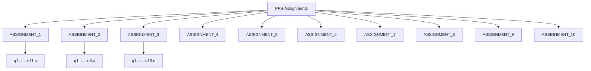

# Programming for Problem Solving Lab Assignments

**Institution:** Academy of Technology  
**Subject:** Programming for problem solving  
**Subject Code:** ES-CS291  
**Discipline:** B.Tech (All)  
**Semester:** 2nd

This repository contains C programming lab assignments organized by assignment number.

## Repository Structure

## Notes

- Each assignment folder contains one or more C source files for the corresponding lab exercises.
- Open the relevant `.c` file in VS Code to build and run it with your configured C/C++ toolchain.
